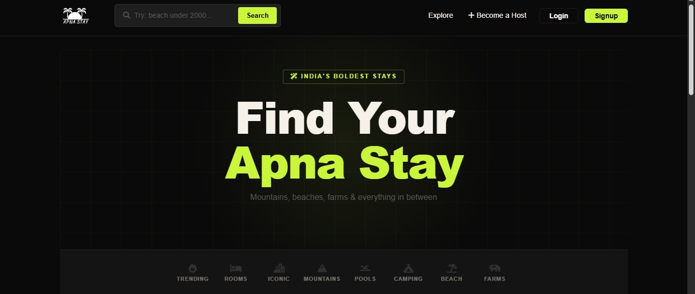

# 🌴 ApnaStay - AI-Powered Travel & Stay Platform

> **A full-stack Airbnb-inspired platform** - with real AI features built in.  
> Discover unique stays, generate listings with AI, search in natural language, and summarize reviews instantly.

[](https://apna-stay-eosin.vercel.app/listings)
[](https://github.com/nikitatale/ApnaStay)
[](https://www.linkedin.com/in/nikita-tale)

---

## 🖼️ Demo Preview



---

## 🤖 AI-Powered Features (Groq LLaMA 3.1)

| Feature | How It Works |
|---|---|
| ✨ **Description Generator** | Enter title + location → AI auto-generates listing description |
| 🔍 **Smart Natural Language Search** | Type *"beach under ₹2000"* → AI finds best matching listings |
| 📝 **Review Summarizer** | 3+ reviews → AI generates a 2-3 line summary instantly |

---

## ✨ What Makes This Project Stand Out

| Feature | Description |
|---|---|
| 🔐 **User Authentication** | Secure login/signup with Passport.js |
| 🏠 **Full CRUD** | Create, read, update, delete listings |
| 🗂️ **Category Filters** | Browse by Trending, Beach, Mountains, Camping & more |
| ⭐ **Reviews & Ratings** | Star rating system with Starability |
| 🗺️ **Map Integration** | Google Maps embed on listing detail page |
| 📸 **Image Uploads** | Cloudinary integration via Multer |
| 📱 **Fully Responsive** | Mobile-friendly dark theme UI |
| ✅ **Form Validation** | Server-side with Joi + client-side with Bootstrap |

---

## 🛠️ Tech Stack

```
Frontend     → EJS, Bootstrap, Custom CSS
Backend      → Node.js, Express.js
Database     → MongoDB, Mongoose
Auth         → Passport.js (Local Strategy)
File Uploads → Multer + Cloudinary
AI Features  → Groq API (LLaMA 3.1)
Validation   → Joi
Architecture → MVC
Deployment   → Vercel
```

---

## 🚀 Getting Started Locally

### Prerequisites
- Node.js v18+
- MongoDB Atlas account
- Cloudinary account
- Groq API key (free at [console.groq.com](https://console.groq.com))

### Installation
```bash
git clone https://github.com/nikitatale/ApnaStay.git
cd ApnaStay
npm install
cp .env.example .env
# Fill in your .env values
node app.js
```

### Environment Variables
```env
MONGO_URL=your_mongodb_url
SECRET=your_session_secret
CLOUDINARY_CLOUD_NAME=your_cloud_name
CLOUDINARY_KEY=your_cloudinary_key
CLOUDINARY_SECRET=your_cloudinary_secret
GROQ_API_KEY=your_groq_api_key
```

---

## 📁 Project Structure

```
ApnaStay/
├── models/          # Mongoose schemas (listing, review, user)
├── routes/          # Express routers (listings, reviews, user)
├── views/           # EJS templates
├── public/          # Static assets (css, js)
├── utils/           # Helper functions
├── middleware.js
└── app.js
```

---

## 💡 Key Learnings & Challenges

- Integrated **Groq LLaMA 3.1 API** for 3 distinct AI features in one app
- Built **natural language search** — parsing user intent to query MongoDB
- Implemented **MVC architecture** keeping codebase clean and scalable
- Handled **image uploads** with Multer + Cloudinary pipeline
- Built full **auth & authorization** — users can only edit/delete their own listings

---

## 👩‍💻 About the Developer

**Nikita Tale** - Full-Stack Developer specializing in MERN Stack  
Open to work! Let's connect →  
[](https://www.linkedin.com/in/nikita-tale)
[](https://github.com/nikitatale)

---

> ⭐ If you found this project interesting, please star it - it helps a lot!
